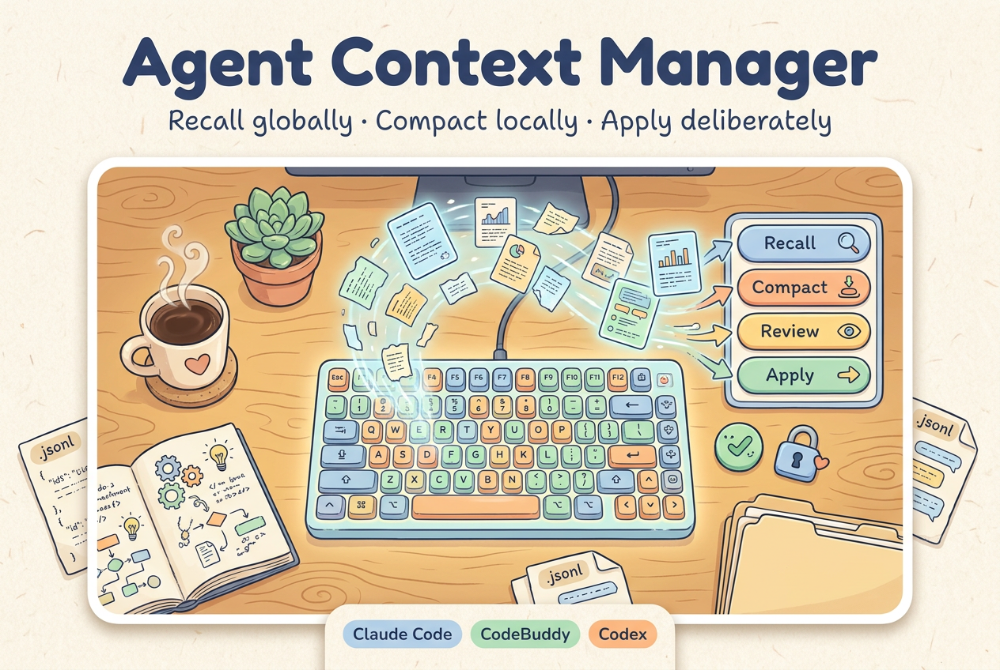

# 🚀 Agent Context Manager

<p align="center">
  
</p>

<p align="center">
  <strong>Async cross-harness context management for agent sessions.</strong>
</p>

<p align="center">
  • Global Recall • Local Compact • Reviewable Context Jobs •
</p>

<p align="center">
  <a href="README.zh-CN.md">中文文档</a> •
  <a href="#-features">Features</a> •
  <a href="#-quick-start">Quick Start</a> •
  <a href="#-commands">Commands</a> •
  <a href="#-safety-model">Safety Model</a> •
  <a href="docs/design.md">Design</a>
</p>

<p align="center">
  <a href="https://github.com/OpenClaudex/agent-context-manager/releases"></a>
  <a href="LICENSE"></a>
  
  
  
  
  
</p>

> [!IMPORTANT]
> **Recall globally. Compact locally. Apply deliberately.**
>
> Agent sessions do not only need a bigger prompt window. They need a safer way to bring old context back, compress current context, and decide what should actually enter the active conversation.
>
> Agent Context Manager (`ctx`) turns context work into reviewable background jobs: recall or compact first, inspect the candidate result, then apply or discard it.

## 🧭 Quick Navigation

> [!TIP]
> **I'm a human** -> Continue reading this README for setup, commands, limits, and project context.
>
> **I'm an agent** -> Read the slash-command skills in [`skills/`](skills) and the design notes in [docs/design.md](docs/design.md).

Agent Context Manager is a small set of slash-command skills and Python workers for asynchronous context management in local agent sessions. Its command namespace is `ctx`.

- **For Claude Code and CodeBuddy**: install `/ctx-recall`, `/ctx-compact`, and `/ctx-jobs` as skills.
- **For Codex and other harnesses**: run the backend directly through the Python CLI.
- **For cross-harness recall**: search local Claude Code, CodeBuddy, and Codex conversation logs from one session.
- **For context safety**: candidate context is not applied automatically; it goes through a job queue.

**Status:** `0.1-alpha`

> Not affiliated with Anthropic, OpenAI, CodeBuddy, Codex, or VCC. Use only on local logs and sessions you are authorized to access.

## ⚡ Quick Start

```bash
git clone https://github.com/OpenClaudex/agent-context-manager.git
cd agent-context-manager
```

### Claude Code

```bash
./scripts/install-claude.sh
```

Restart Claude Code, then use:

```text
/ctx-recall "why did we choose BM25 instead of embeddings"
/ctx-compact preserve architecture decisions and TODOs
/ctx-jobs
```

### CodeBuddy

```bash
./scripts/install-codebuddy.sh
```

Restart CodeBuddy before using the same `/ctx-*` commands.

### Codex / Generic CLI

```bash
PYTHONPATH=src python3 -m context_os.ctx.workers.recall "VCC architecture" --scope all --budget 8000 --max-hits 5
PYTHONPATH=src python3 -m context_os.ctx.runner list
```

## ✨ Features

Agent Context Manager focuses on reviewable context operations:

- Runs recall and compact as background jobs, so the foreground conversation can continue.
- Recalls historical context across local Claude Code, CodeBuddy, and Codex JSONL logs.
- Compacts the current session into a structured candidate summary.
- Stores results in a simple local file-based job queue.
- Separates candidate generation from application through `apply` / `discard`.
- Uses VCC-style conversation compilation for transcript search and context views.
- Supports `claude -p` or `codebuddy -p` for background summarization.

## 🧩 Commands

| Command | Scope | Expected Behavior |
|---|---|---|
| `/ctx-recall <query>` | Global, cross-harness | Search historical local logs and produce a candidate context block. |
| `/ctx-compact [instruction]` | Current session | Produce a candidate compact summary of the active session. |
| `/ctx-jobs` | Local job store | List jobs, preview results, apply completed results, or discard noise. |

### Local Recall Sources

`/ctx-recall` can search:

```text
~/.codebuddy/projects
~/.claude/projects
~/.claude-internal/projects
~/.codex/sessions
~/.codex-internal/sessions
```

Supported recall scopes:

```text
--scope all | codebuddy | claude | codex
```

## 🛡️ Safety Model

Agent Context Manager treats context injection as a risky operation.

- **Review before apply.** Recall and compact results are candidates, not automatic prompt mutations.
- **No hidden cloud storage.** Jobs are local JSON files under `.ctx/jobs/`.
- **No credential persistence.** Do not put secrets, tokens, private screenshots, or credentials into examples or job results.
- **Current-session compact only.** `/ctx-compact` summarizes the active session, not the entire user history.
- **Best-effort recall.** `/ctx-recall` can miss relevant history or return meta-results; users should inspect before applying.
- **Explicit VCC dependency.** VCC is currently used as the compilation/search backend.

## 🧪 Why This Exists

Most agent harnesses already persist rich traces: user messages, assistant reasoning summaries, tool calls, terminal output, and file paths. The problem is not always that the agent has no memory. The problem is that useful context lives outside the current working window.

Agent Context Manager is not a memory palace. It is a lightweight operating loop for context:

```text
recall old context -> compact current context -> review result -> apply deliberately
```

## 📚 Docs

- [Design Notes](docs/design.md)
- [Agent Context Manager and VCC](docs/vcc-comparison.md)
- [Claude Code installer](scripts/install-claude.sh)
- [CodeBuddy installer](scripts/install-codebuddy.sh)
- Skills: [`ctx-recall`](skills/ctx-recall/SKILL.md), [`ctx-compact`](skills/ctx-compact/SKILL.md), [`ctx-jobs`](skills/ctx-jobs/SKILL.md)

## 🗺️ Roadmap

- **v0.1**: async recall, async compact, jobs list/show/apply/discard.
- **v0.2**: cleaner CodeBuddy/Codex packaging and install flow.
- **v0.3**: source policy controls, privacy filters, and stronger stale detection.
- **v0.4**: pluggable recall backends beyond VCC.

## 🌐 Related Projects

Agent Context Manager focuses on context-management skills for agent sessions. Related projects:

- [VCC](https://github.com/lllyasviel/VCC) - View-oriented Conversation Compiler for agent trace analysis and conversation recovery.
- [OpenReview Agent](https://github.com/OpenClaudex/openreview-agent) - OpenClaudex skill and CLI toolkit for safe OpenReview submission workflows.
- [Open Claudex Computer Use](https://github.com/OpenClaudex/open-claudex-computer-use) - background computer use for Claude Code, Codex, and MCP agents on macOS.

## ⭐ Star History

<a href="https://star-history.com/#OpenClaudex/agent-context-manager&Date">
  <picture>
    <source media="(prefers-color-scheme: dark)" srcset="https://api.star-history.com/svg?repos=OpenClaudex/agent-context-manager&type=Date&theme=dark" />
    <source media="(prefers-color-scheme: light)" srcset="https://api.star-history.com/svg?repos=OpenClaudex/agent-context-manager&type=Date" />
    
  </picture>
</a>

## 📄 License

[MIT](LICENSE)

---

<p align="center">
  If this project helps your agent remember the right thing at the right time, please give it a ⭐ Star!
</p>

<p align="center">
  <a href="https://github.com/OpenClaudex/agent-context-manager/issues">Report Issues</a> ·
  <a href="https://github.com/OpenClaudex/agent-context-manager/issues/new?labels=enhancement">Feature Requests</a>
</p>
